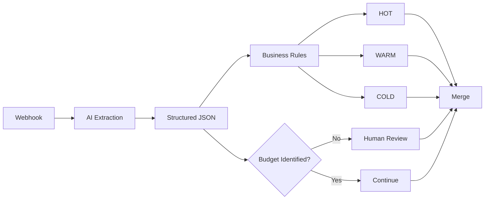

# AI-Powered Lead Qualification & CRM Automation

An AI-powered workflow for extracting lead information from unstructured text, applying deterministic business rules, and routing leads based on their qualification status.

> **Portfolio Project — Version 1**

## Business Problem

Businesses often receive leads through forms, websites, or other channels. Lead information may be incomplete or written as free text, making it difficult to consistently understand and qualify each lead.

Manual lead qualification can take time and may lead to inconsistent decisions.

A structured qualification process can help businesses:

* Extract important information from incoming leads.
* Apply consistent qualification criteria.
* Identify leads that may require further human review.
* Separate AI-based information extraction from business decision-making.

The goal of this project is to demonstrate how AI and workflow automation can be combined to support a real business process.

## Solution

This project uses **n8n** to build an automated lead qualification workflow.

The system receives lead information through a webhook. An AI model extracts relevant information from the lead's text and returns structured data.

The structured data is then processed by deterministic business rules in n8n to classify the lead as:

* **HOT**
* **WARM**
* **COLD**

If the budget information cannot be identified, the workflow marks the lead for **Human Review**.

A key design principle of this project is that the AI does **not** make the final qualification decision.

The AI is responsible for information extraction and structuring. The qualification decision is handled separately through explicit business rules.

## How It Works

### 1. Receive Lead

A webhook receives lead information such as:

* Name
* Phone
* Need
* Other lead information provided in the request

### 2. Extract Information with AI

The lead's text is sent to an AI model.

The AI extracts relevant information and converts it into structured fields such as:

* Need
* Timeline
* Budget
* Whether the need was identified
* Whether the timeline was identified
* Whether the budget was identified
* Confidence

### 3. Create Structured JSON

The extracted information is represented as structured JSON so that it can be processed consistently by the workflow.

### 4. Apply Business Rules

n8n evaluates the structured data using predefined business rules.

The rules determine whether the lead is:

* HOT
* WARM
* COLD

### 5. Human Review

If the budget cannot be identified, the workflow sets:

`human_review = true`

This allows the case to be identified for human attention instead of relying entirely on automated processing.

### 6. Merge Workflow Paths

The workflow merges the processed paths into the final workflow output.

## Workflow Architecture



### Architecture Principle

The workflow intentionally separates two responsibilities:

**AI Layer**

* Extract information from unstructured text.
* Structure the extracted information.

**Business Logic Layer**

* Apply explicit qualification rules.
* Determine HOT / WARM / COLD.
* Flag leads for Human Review.

This separation makes the qualification logic easier to understand and modify independently from the AI extraction step.

## Lead Data Structure

The current lead structure includes the following fields:

| Field                 | Description                                     |
| --------------------- | ----------------------------------------------- |
| `name`                | Lead name                                       |
| `phone`               | Lead phone number                               |
| `need`                | Extracted description of the lead's need        |
| `need_identified`     | Whether the need was identified                 |
| `timeline`            | Extracted timeline information                  |
| `timeline_identified` | Whether the timeline was identified             |
| `budget`              | Extracted budget information                    |
| `budget_identified`   | Whether the budget was identified               |
| `confidence`          | Confidence value associated with the extraction |
| `qualification`       | Final HOT / WARM / COLD classification          |
| `human_review`        | Indicates whether human review is required      |

## Qualification Logic

The final qualification is determined by business rules rather than by the AI model.

| Need Identified | Timeline Identified | Qualification |
| --------------- | ------------------- | ------------- |
| `true`          | `true`              | **HOT**       |
| `true`          | `false`             | **WARM**      |
| `false`         | `true`              | **WARM**      |
| `false`         | `false`             | **COLD**      |

### Important Design Decision

The AI does not directly decide whether a lead is HOT, WARM, or COLD.

Instead:

```text
Lead Text
    ↓
AI Information Extraction
    ↓
Structured Data
    ↓
Deterministic Business Rules
    ↓
HOT / WARM / COLD
```

This makes the qualification logic explicit and easier to inspect.

## Human Review Logic

Human review is triggered when the budget cannot be identified.

```text
IF budget_identified = false
    → human_review = true
```

If the budget is identified:

```text
human_review = false
```

The Human Review flag is currently part of the workflow data and is intended to identify cases that require human attention.

## Technology Stack

* **n8n** — Workflow automation
* **Webhook** — Lead input
* **LLM / AI** — Information extraction
* **Basic LLM Chain** — AI processing
* **OpenAI-compatible Chat Model** — Language model connection
* **JavaScript / Code Node** — Workflow data processing
* **IF Nodes** — Conditional business logic
* **Edit Fields / Set** — Data preparation and transformation
* **Merge** — Combining workflow paths

## Current Status / Version

**Version:** v1

The core workflow is currently implemented as a working portfolio project and is still under development.

The current version demonstrates:

* Webhook-based lead intake
* AI information extraction
* Structured lead data
* Deterministic qualification rules
* HOT / WARM / COLD classification
* Human Review flagging
* Workflow path merging

The project is not intended to represent a production-ready CRM automation system at this stage.

## Testing

Testing is currently focused on verifying the implemented workflow behavior.

### Tested

* Webhook receives lead information.
* AI extraction produces structured lead fields.
* Qualification rules are implemented in the n8n workflow.
* HOT / WARM / COLD classification follows the defined business rules.
* Human Review is triggered when `budget_identified = false`.

### Not Tested Yet

* Extensive edge-case testing
* Invalid or malformed input handling
* Workflow error handling
* Retry behavior
* AI fallback behavior
* Duplicate lead detection
* Production-scale reliability
* Database or CRM integration
* Monitoring and logging

Additional testing will be added as the project develops.

## Screenshots / Demo

Screenshots of the n8n workflow and relevant workflow nodes will be added here.

### Workflow Screenshot

> **TODO:** Add screenshot of the complete n8n workflow.

### AI Extraction Screenshot

> **TODO:** Add screenshot showing the structured output generated by the AI extraction step.

### Demo

> **TODO:** Add a recorded or live workflow demonstration when available.

## Project Structure

The project is currently centered around an n8n workflow.

A simple project structure can be organized as:

```text
ai-lead-qualification/
│
├── README.md
│
├── workflow/
│   └── lead-qualification-workflow.json
│
└── screenshots/
    └── workflow.png
```

> The repository structure may evolve as the project develops.

## Future Improvements

The following improvements are planned as future development steps. They are **not implemented in the current version**.

### Edge Case Handling

Handle unusual or incomplete lead inputs and define how the workflow should behave in ambiguous situations.

### Input Validation

Validate incoming webhook data before processing it.

### Error Handling

Add explicit handling for workflow and processing errors.

### Retry / Fallback

Add retry mechanisms and fallback behavior for failures during AI processing.

### Database / CRM Integration

Connect the workflow to a database or CRM so qualified leads can be stored and managed.

### Duplicate Lead Detection

Detect potential duplicate leads before creating or processing a new lead record.

### Notification

Add notifications for relevant qualification results or leads requiring Human Review.

### Monitoring / Logging

Add monitoring and logging to make workflow behavior and failures easier to track.

## What I Learned

This project helped me practice several important concepts in AI automation and business process integration.

### Translating a Business Problem into Business Rules

I learned how to take a business requirement such as lead qualification and translate it into explicit, testable rules.

For example:

```text
Need + Timeline identified
        ↓
       HOT
```

### Designing Structured Data

I practiced designing structured fields that can represent information extracted from unstructured lead text.

### AI Information Extraction

I learned how an LLM can be used to extract relevant information from natural language and return structured data for further processing.

### Separating AI from Deterministic Business Logic

One of the main lessons from this project was the importance of separating AI-based extraction from deterministic business decisions.

The AI extracts information.

The workflow applies the business rules.

This makes the decision logic explicit instead of relying on the model to make the final business decision.

### Designing Workflows in n8n

I practiced building a multi-step automation workflow using:

* Webhooks
* AI/LLM nodes
* Structured data
* Conditional logic
* Code
* Workflow branches
* Merge operations

### Human-in-the-Loop

I also practiced designing a workflow where automation does not have to handle every case automatically.

When important information such as the budget is missing, the workflow can flag the lead for human review.

## Project Status

**Version:** v1
**Status:** In Development
**Next Step:** Reliability & Edge Case Testing
